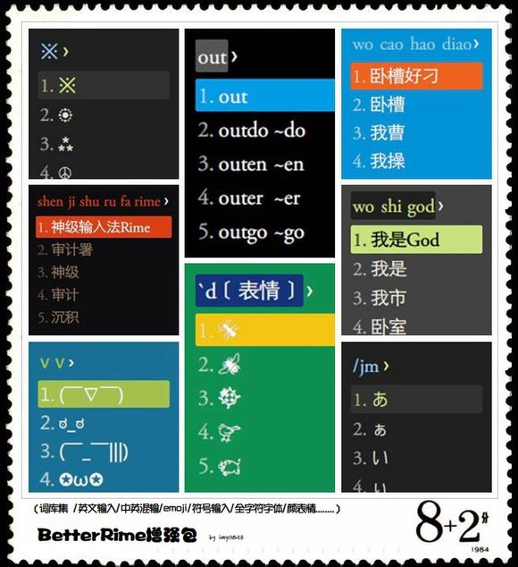

# better-rime-dict
BetterRime词库增强包，贴吧：http://tieba.baidu.com/p/4125987751

老物一件，最近创了个新Github号，顺手丢上来，(σ｀д′)σ

这词库第一版的时候好像还是两年半前的事了，时间过得真快~

目前版本是实用版V2.01，适用明月拼音（五笔&双拼看贴子），Win/Linux下Rime测试ok，其它版本我没用过，不确定。

大半年没更新了，不过还是蛮好用的，过段时间应该会更新下的，适配下PIME什么的。

一般词也没啥好更新了，常规更下，and打算从各种百科里面爬点流行词条~

截图：老图了(懒得截o(*////▽////*)q)，现在可能不大一样，具体看贴吧~

and关于转载修改之类的，无所谓，随便都行，never mind~

